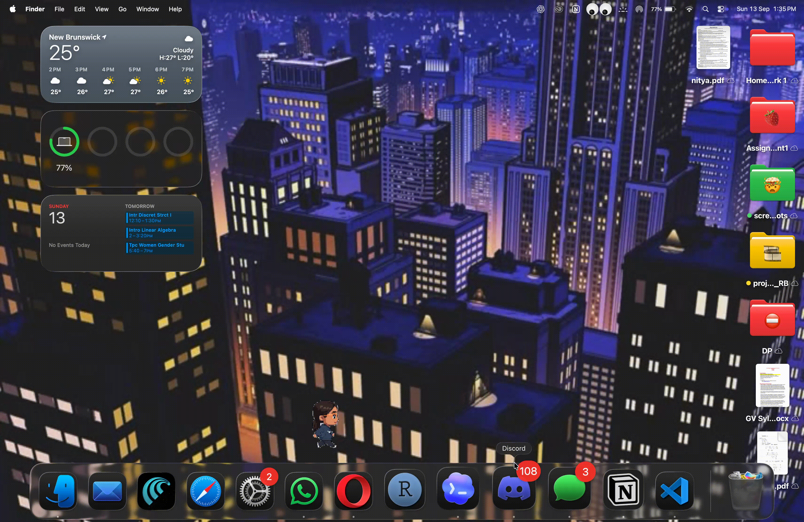
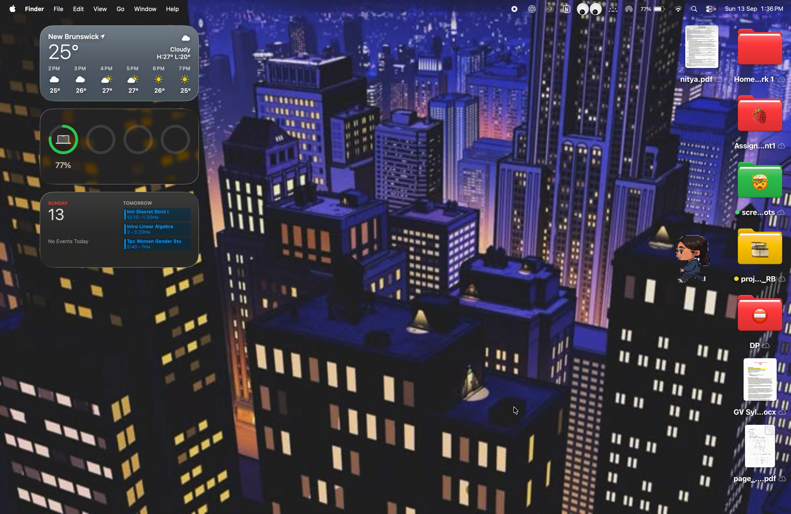
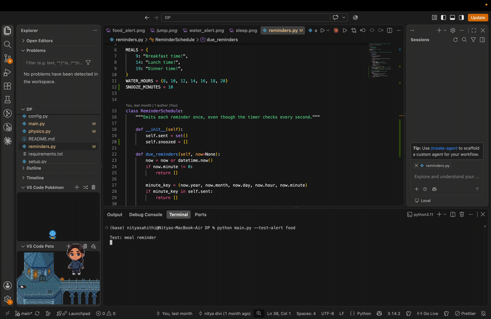
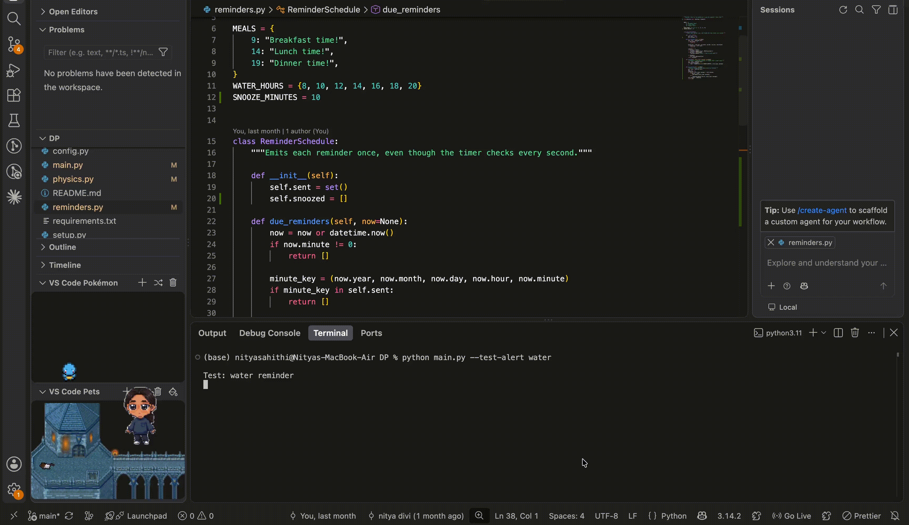

# Desktop Pet 🕷️

A lightweight pixel-art Spider-Man version of me as a  desktop companion for macOS. The pet lives on the Finder desktop, walks across the screen, sleeps when the mouse is inactive, responds to clicks with a web-shot jump, and provides food and water reminders.

## 🕷️ See It In Action

<div align="center">

<table>
<tr>
<td align="center">
<br>
<b>🕸️ Web Swing</b><br>
<sub>Jump to wherever you click on the desktop</sub>
</td>

<td align="center">
<br>
<b>💤 Sleep Mode</b><br>
<sub>The pet sleeps when the mouse is inactive</sub>
</td>
</tr>

<tr>
<td align="center">
<br>
<b>🍜 Food Reminder</b><br>
<sub>Scheduled reminders for meals</sub>
</td>

<td align="center">
<br>
<b>💧 Water Reminder</b><br>
<sub>Reminders to stay hydrated</sub>
</td>
</tr>
</table>

</div>
## Features

- Transparent, borderless desktop-pet window
- Frame-based pixel-art animations for idle, walking, jumping, sleeping, food alerts, and water alerts
- Automatic left/right walking with screen-edge handling
- Click the pet to return it to idle
- Click the Finder desktop to fire a web line and jump to the selected location
- Web jumping is limited to the desktop; the pet does not react to clicks in other applications
- Sleep animation after 20 seconds without mouse movement; moving the mouse wakes the pet
- Food reminders at 9:00 AM, 2:00 PM, and 7:00 PM
- Water reminders every two hours from 8:00 AM through 8:00 PM
- Alerts remain visible above the active application; the regular pet stays on the Finder desktop
- Reminder alerts loop until clicked; clicking one snoozes it for 10 minutes
- Avoids visible windows/widgets when macOS supplies their bounds

## Requirements

- macOS
- Python 3.10 or newer
- Pillow
- PyObjC

## Installation

1. Clone or download this repository.

2. Open Terminal in the project folder.

3. Install the dependencies:

   ```bash
   pip install -r requirements.txt
   ```

4. Start the pet:

   ```bash
   python main.py
   ```

## How to Use

1. Return to the Finder desktop to see the pet. It hides when you switch to another app, except while displaying a reminder.

2. Let the pet complete its idle animation; it will begin walking automatically.

3. Click directly on the pet to put it back into idle mode.

4. Click elsewhere on the Finder desktop to launch a web-shot jump. The pet lands with its centre at the clicked location, while remaining within the screen bounds.

5. Leave the mouse still for 20 seconds to trigger the sleep animation. Move the mouse to wake the pet.

## Reminder Schedule

| Reminder | Times |
| --- | --- |
| Breakfast | 9:00 AM |
| Lunch | 2:00 PM |
| Dinner | 7:00 PM |
| Water | 8:00 AM, 10:00 AM, 12:00 PM, 2:00 PM, 4:00 PM, 6:00 PM, 8:00 PM |

At 2:00 PM, the lunch alert plays before the water alert.

Reminder animations continue until you click them. Clicking an alert snoozes it for 10 minutes, then it will appear again.

## Test Alert Animations

You can test the alert sheets immediately, without waiting for the scheduled time:

```bash
# Test the meal / food alert
python main.py --test-alert food

# Test the water alert
python main.py --test-alert water

# Play the food alert, followed by the water alert
python main.py --test-alert both
```

## Project Structure

```text
desktop-pet/
├── assets/          # Sprite sheets and character artwork
├── animation.py     # Loads and advances sprite-sheet frames
├── main.py          # Application entry point
├── reminders.py     # Meal and water reminder schedule
├── window.py        # AppKit window, interactions, animation states, and alerts
├── physics.py       # Reserved for future movement-physics work
├── requirements.txt # Python dependencies
└── README.md        # Project documentation
```

## Sprite Sheets

All animation assets are stored in `assets/` as PNG sprite sheets. The application splits each horizontal sheet into frames and renders them inside a 128×128 transparent desktop window.

| Asset | Purpose |
| --- | --- |
| `idle.png` | Resting animation |
| `walk_left.png` / `walk_right.png` | Directional walking animations |
| `jump.png` | Web-shot jump animation |
| `sleep.png` | Mouse-inactivity animation |
| `food_alert.png` | Meal reminder animation |
| `water_alert.png` | Water reminder animation |

## Technologies

- **Python** — application logic
- **PyObjC / AppKit** — native macOS windows, timers, and input monitoring
- **Pillow** — sprite-sheet processing
- **Quartz** — visible-window lookup for obstacle avoidance

## macOS Permissions

The pet can still run without extra permissions. To let it reliably identify windows and widgets for avoidance, macOS may require Screen Recording permission for the Terminal or Python app you use to launch it:

1. Open **System Settings → Privacy & Security → Screen Recording**.
2. Enable access for your terminal application or Python.
3. Restart the pet.

## Notes

- Keep the supplied filenames in `assets/` unchanged; the app loads them by name.
- The app uses AppKit/PyObjC, not Tkinter.
- `physics.py` is currently reserved for a future reusable physics implementation; the existing walking and web-jump behavior remains in `window.py`.

## Future Ideas

- Configurable reminder times
- Sound effects and volume controls
- Additional behaviours and sprite sheets
- Preferences panel for speed, sleep timing, and alerts
- Optional full physics-based web swinging

## Author

Nitya Divi
